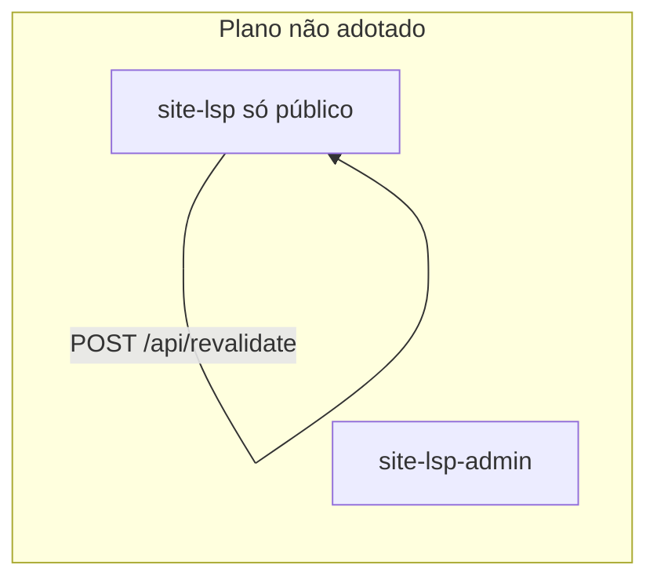

---
tags:
  - adr
  - site-lsp
  - arquitetura
  - arquivado
status: nao-adotada
data-decisao: '2026-08-24'
ultima-revisao: '2026-09-21'
projeto: site-lsp
repositorio: 'C:/Estudos/site-lsp'
---

# ADR-001 — Separar o painel CMS em outro repositório (arquivada)

> **Status (setembro/2026): não adotada.** O produto permanece um **monólito** no repositório `site-lsp`. Documentação canônica de deploy: [[Modelo de Deploy]].

## Resumo

Em agosto/2026 foi **discutida** a extração de `/admin` para um repositório `site-lsp-admin`, com site público isolado, `POST /api/revalidate` cross-app, migrações só no admin e admin em rede Docker interna.

**Nada disso foi implementado.** O código continua em `app/admin/` no mesmo Next.js; cache invalidado in-process; migrações e seed no entrypoint deste repo.

## Por que esta nota permanece

Registro histórico para não reintroduzir confusão em PRs ou runbooks. Novas decisões de split exigiriam **novo ADR** e revisão de deploy.

## Onde está a verdade operacional

| Recurso | Conteúdo |
| --- | --- |
| [[Modelo de Deploy]] | Monólito, Docker, variáveis reais |
| [[Visão Geral]] | Mapa da wiki |
| `DOCUMENTATION.md` §21 | Fonte versionada no Git |
| `README.md` | Setup e visão rápida |

## Diagrama alvo (nunca implementado)

## Relacionado

- [[Arquitetura]] · [[Painel Admin]] · [[APIs e Integrações]]
