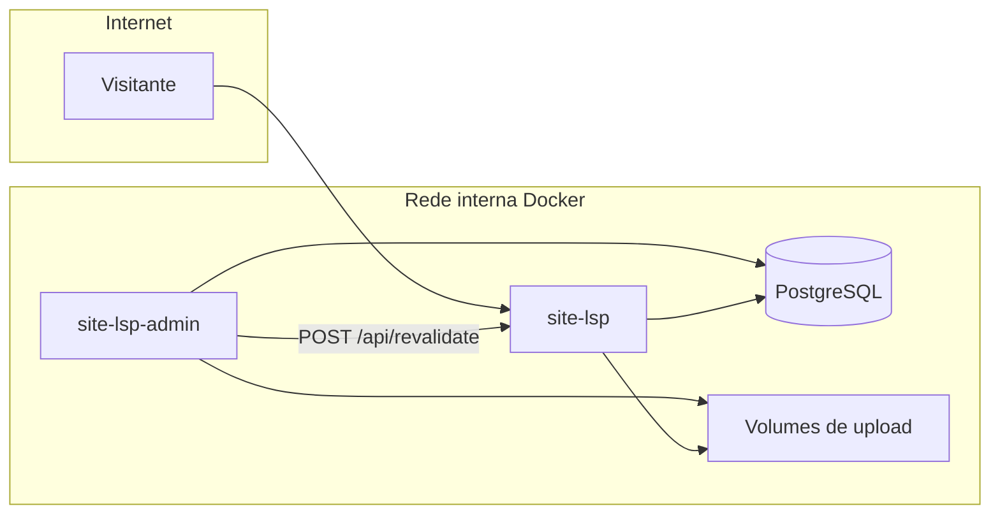

---
tags:
  - adr
  - site-lsp
  - arquitetura
  - nextjs
status: aceita
data-decisao: 2026-08-24T00:00:00.000Z
ultima-revisao: '2026-09-18T00:00:00.000Z'
projeto: site-lsp
repositorio: 'C:/Estudos/site-lsp'
---

# ADR-001 — Separar o painel CMS (`/admin`) em um projeto Next.js independente

## Contexto

O repositório **site-lsp** concentra hoje duas responsabilidades distintas:

| Superfície | Responsabilidade | Exemplos no código |
| --- | --- | --- |
| **Site público** | Leitura de conteúdo, contato, ingestão de analytics | `app/page.tsx`, `app/lib/public-content.ts`, `app/api/contact`, `app/api/analytics` |
| **Painel admin** | CRUD de conteúdo, Auth.js, MFA, usuários, dashboard de analytics | `app/admin/` (~88 arquivos), `auth.ts`, `app/lib/auth/` |

Evoluções recentes no mesmo repo (Auth.js com sessões em banco, MFA TOTP, onboarding, hardening de produção, documentação técnica em `DOCUMENTATION.md`) aumentaram a superfície de segurança e operação do monólito. Surgiu a exigência de **isolar o CMS** do site exposto à internet.

## Decisão

1. **Extrair todo o painel `/admin`** para um novo repositório **`site-lsp-admin`** (Next.js 16, mesma stack: Prisma 7, PostgreSQL, Tailwind 4).
2. **Manter `site-lsp` apenas como site público** — leitura no banco, APIs públicas (contato, analytics, health), sem auth administrativa.
3. **Não usar monorepo** — dois repositórios separados; schema Prisma sincronizado por processo explícito (admin como fonte da verdade de migrações).
4. **Dois containers Docker** na mesma rede interna:
   - Site: exposto à internet (reverse proxy / porta pública).
   - Admin: **somente rede interna** (sem binding público; acesso via VPN / proxy corporativo).
5. **Banco e arquivos compartilhados**:
   - Mesmo PostgreSQL (`DATABASE_URL`).
   - Mesmos volumes Docker para uploads (`public/banners`, `units`, `vacinas`, `convenios`) — **já** mapeados no compose atual do monólito.
6. **Invalidação de cache cross-app**: após edições no admin, chamar `POST /api/revalidate` no site (Bearer `REVALIDATE_SECRET`) em vez de `revalidatePublicHomeContent()` in-process.
7. **Migrações e seed**: executados **somente** no pipeline/container do `site-lsp-admin`; o site roda `prisma generate` no build e **não** aplica `migrate deploy` no startup.

### Alternativas consideradas

| Opção | Motivo de rejeição |
| --- | --- |
| Monorepo (`apps/site` + `apps/admin` + pacote database) | Descartada: preferência por **repos totalmente separados** e deploy independente. |
| Mesmo domínio com path `/admin` via reverse proxy | Descartada em favor de admin **fora da internet pública** (container interno). |
| Strapi / CMS externo | Discutida em outra linha de trabalho; **não** é esta decisão — mantemos CMS custom em Next.js, apenas separado. |

## Consequências

### Positivas

- Menor superfície de ataque no site público (sem rotas auth, MFA, CRUD).
- Deploy e rollback do CMS desacoplados do site institucional.
- Política de rede clara: visitantes nunca alcançam o container admin.

### Negativas / trade-offs

- Duplicação de `prisma/schema.prisma` e libs compartilhadas (`env`, `mail`, `rateLimit`, etc.) — exige checklist ou script de sync em cada PR de schema.
- Revalidação de cache depende de rede interna e segredo compartilhado; falhas devem ser logadas e monitoradas.
- Links em e-mails (reset de senha, verificação) passam a usar `ADMIN_URL`, não `SITE_URL`.

## Diagrama (visão alvo)

## Variáveis de ambiente (contrato entre apps)

| Variável | Onde | Uso |
| --- | --- | --- |
| `SITE_URL` | Site | URLs públicas, links institucionais |
| `ADMIN_URL` | Admin | Links em e-mails de auth |
| `SITE_INTERNAL_URL` | Admin | Hostname Docker do site (revalidação) |
| `REVALIDATE_SECRET` | Site + Admin | Bearer token do endpoint de revalidação |
| `DATABASE_URL` | Ambos | Mesmo cluster PostgreSQL |

## Wiki do projeto

- Hub: [[Visão Geral]]
- Arquitetura atual (monólito): [[Arquitetura]] · [[Painel Admin]]

## Estado da implementação (2026-09-18)

| Item | Status |
| --- | --- |
| Plano de migração documentado (fases 1–5) | Concluído |
| Código admin ainda em `site-lsp/app/admin/` | **Pendente** extração |
| `POST /api/revalidate` no site | **Pendente** |
| Repositório `site-lsp-admin` | **Pendente** |
| Docker split + rede interna | **Pendente** |

Ordem recomendada de execução: criar admin standalone → implementar revalidate no site → validar dois containers → remover admin de `site-lsp`.

## Relacionado no projeto

- Documentação técnica versionada: `DOCUMENTATION.md` na raiz; PDF gerado localmente via `npm run docs:pdf` (artefatos em `.codex/docs/`, fora do Git).
- Autenticação atual: Auth.js v5, sessões em PostgreSQL, Argon2id, MFA TOTP — **permanece no app admin** após a separação.
- Analytics: ingest no site; agregações/dashboard no admin.

## Referências

- Repositório: `C:\Estudos\site-lsp`
- Plano interno Cursor: *Separar CMS Admin* (agosto/2026)
