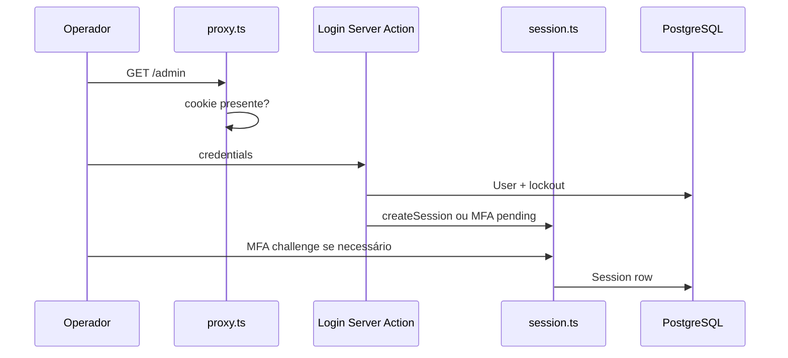

---
tags:
  - site-lsp
  - arquitetura
projeto: site-lsp
ultima-revisao: '2026-09-18'
---

# Arquitetura — site-lsp

[[Visão Geral]] · [[Painel Admin]] · [[Site Público]] · [[Autenticação e Segurança]]

## Camadas

| Camada | Onde | Papel |
| --- | --- | --- |
| **UI** | `app/page.tsx`, `app/components/*`, `app/admin/*` | React Server/Client Components |
| **Server Actions** | `app/admin/**/actions.ts` | Mutações admin com guards |
| **Route Handlers** | `app/api/*` | Contato, analytics, health, Auth.js |
| **Domínio / lib** | `app/lib/*` | Auth, cache, mail, rate limit, validação |
| **Dados** | Prisma + PostgreSQL | Conteúdo, sessões, analytics, rate limits |
| **Edge** | `proxy.ts` | CSP com nonce (prod) + gate cookie em `/admin` |

## Fluxo — conteúdo público

1. `app/page.tsx` chama `getPublicHomeContent()` em `app/lib/public-content.ts`.
2. Leitura via `unstable_cache` com tag `public-home-content` e `revalidate: 300` (`app/lib/cache/public-content.ts`).
3. Se não houver registros ativos ou houver falha de DB → fallbacks estáticos embutidos.
4. Após CRUD no admin → `revalidateTag` + `revalidatePath("/")` (paths em `ADMIN_REVALIDATE_PATHS` em `app/lib/routes.ts`).

**Detalhe de produto:** o CTA fixo "Agendar Coleta no WhatsApp" na home não usa `buttonText` do banner; o link opcional do banner vale para **clique na imagem**.

## Fluxo — autenticação admin (resumo)



- Auth.js v5 com **Database Sessions** (`Session` no Prisma), não JWT para credentials.
- Login customizado em Server Actions (`app/admin/actions.ts`) — evita fluxo Credentials+JWT padrão.
- `proxy.ts` só valida **presença** de cookie em rotas `/admin`; autoridade real em `requireAdmin` / `requireFullyOnboardedAdmin` nos layouts e actions.
- Onboarding: verificação de e-mail + configuração MFA antes do painel completo.

## Proteção em camadas (admin)

1. **Edge:** CSP + redirect se sem cookie (exceto rotas públicas do admin).
2. **Layout `(panel)`:** sessão válida, MFA satisfeito, onboarding completo.
3. **Server Actions:** revalidação de sessão + role `ADMIN` + schemas Zod.
4. **Rate limits** persistentes por IP/e-mail/userId (ver [[Autenticação e Segurança#Rate limits]]).

## Content Security Policy

- Headers base em `next.config.ts`.
- CSP dinâmica por request em `proxy.ts`: nonce em produção para scripts em páginas dinâmicas; home estática mantém `'unsafe-inline'` onde o Next exige.
- `img-src` inclui domínios do lab e Unsplash (banners seed).

## Padrão de módulo admin

Cada entidade (ex.: banners) segue:

```text
app/admin/<modulo>/
  schema.ts       Zod
  form-state.ts   estado do formulário
  actions.ts      create/update/delete + upload
  *Form.tsx / *Table.tsx
  storage.ts        (quando há arquivo em public/)
app/admin/(panel)/<rota>/page.tsx
```

Uploads típicos: validação MIME/extensão, `sharp`, limites de tamanho; URLs externas (`mapUrl`, `buttonLink`) passam por allowlist.

## Cache e performance

| Item | Detalhe |
| --- | --- |
| Home | `unstable_cache`, tag `public-home-content`, 300s |
| Invalidação | `revalidateTag(..., "max")` + `revalidatePath("/")` |
| Admin layout | `force-dynamic` |
| Sessões | prune oportunista (~15 min) |
| Retenção | prune analytics/audit (~1 h) — [[Autenticação e Segurança#Retenção de dados]] |

## Docker (visão)

Dois serviços no `docker-compose.yml`: `postgres` (16-alpine) e `nextjs` (porta **3500→3000**). Volumes nomeados para uploads (`banners`, `units`, `vacinas`, `convenios`). Entrypoint: `migrate deploy` + seed opcional. Detalhes em [[Runbook#Docker Compose]].

## Evolução planejada

[[ADR-001 Separacao do painel CMS em site-lsp-admin]] — site público chama `POST /api/revalidate` após edições; admin em rede interna; migrações só no app admin. **Pendente.**
