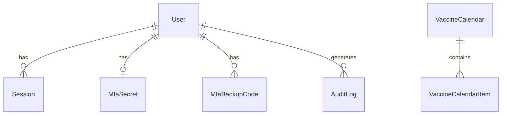

---
tags:
  - site-lsp
  - prisma
  - postgresql
projeto: site-lsp
ultima-revisao: '2026-09-18'
---

# Modelo de dados — site-lsp

[[Visão Geral]] · [[Painel Admin]] · [[Runbook#Banco de dados]]

**Fonte da verdade:** `prisma/schema.prisma` · config Prisma 7: `prisma.config.ts`

## Enums

| Enum | Valores |
| --- | --- |
| `UserRole` | `ADMIN` |
| `AnalyticsEventType` | `PAGEVIEW`, `EVENT` |
| `AnalyticsDeviceType` | `DESKTOP`, `MOBILE`, `TABLET`, `BOT`, `UNKNOWN` |

## Conteúdo público (CMS)

| Modelo | Campos notáveis |
| --- | --- |
| `Banner` | title, imageUrl, buttonText/Link opcionais, isActive, displayOrder |
| `Service` | title, description, icon (Heroicon name) |
| `Unit` | endereço, phones, horários, observation, imageUrl, mapUrl |
| `ExamPrep` | name, observation |
| `AboutSection` | singleton `id = "default"`, paragraphs[] |
| `VaccineCalendar` | title, imageUrl + items filhos |
| `VaccineCalendarItem` | vaccineName, doseDescription, FK calendar |
| `HealthInsurance` | name, logoUrl |

Relação: `VaccineCalendar` 1—N `VaccineCalendarItem` (cascade delete).

## Auth e operadores

| Modelo | Papel |
| --- | --- |
| `User` | Operador admin; passwordHash; lockout; emailVerified |
| `Account` | Adapter Auth.js (OAuth futuro) |
| `Session` | sessionToken, expires, ip, userAgent |
| `VerificationToken` | Verificação de e-mail |
| `MfaSecret` | encryptedSecret, enabledAt, verifiedAt |
| `MfaBackupCode` | codeHash, usedAt |
| `PasswordReset` | tokenHash, expiresAt, usedAt |
| `AuditLog` | event, metadata Json, userId opcional |

## Infra / cross-cutting

| Modelo | Papel |
| --- | --- |
| `RateLimitEntry` | key PK, count, expiresAt |
| `AnalyticsEvent` | métricas de uso do site público |

## Diagrama simplificado

## Migrações

Pasta: `prisma/migrations/` — histórico incremental. Destaques:

| Migration (pasta) | Tema |
| --- | --- |
| `20260716210000_authjs_mfa` | Auth.js + MFA |
| `20260722140000_about_section` | Sobre nós |
| `20260722150000_security_hardening` | Rate limit, audit, hardening |
| `20260819120000_unit_observation` | Campo observation em Unit |
| `20260819140000_health_insurance` | Convênios |

**Dev:** `npm run prisma:migrate` (`migrate dev`)
**Prod/Docker:** `npm run prisma:migrate:deploy` ou entrypoint container

## Seed (`prisma/seed.ts`)

Idempotente:

- Cria **User** admin se `ADMIN_EMAIL` + `ADMIN_PASSWORD` válidos (≥12 chars, letras+números; rejeita senhas de exemplo).
- Popula conteúdo institucional **somente se faltar** (banners, unidades, serviços, preparos, sobre, vacinas, convênios).

Variáveis: `ADMIN_NAME`, `ADMIN_EMAIL`, `ADMIN_PASSWORD`.

## Cliente Prisma

- `app/lib/prisma.ts` — singleton com adapter PG (`@prisma/adapter-pg`).
- Sempre rodar `npm run prisma:generate` após pull que altere schema.
