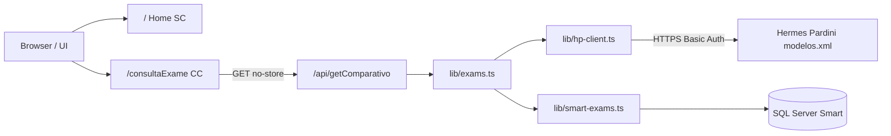

---
tags:
  - xml-reader
  - documentacao
  - nextjs
  - arquitetura
  - api
  - seguranca
projeto: xml-reader
repositorio: C:/Estudos/xml-reader
ultima-revisao: 2026-09-15
---

# xml-reader — Documentação técnica

Índice: [[xml-reader]] · [[xml-reader - Fluxo de negócio]] · [[xml-reader - Setup e operação]]

Espelho estruturado do `DOCUMENTATION.md` do repositório (v0.2.0).

---

## Tech stack

| Camada | Escolha |
| --- | --- |
| Framework | Next.js **14.1.3**, App Router (`app/`) |
| UI | React 18, Tailwind 3, shadcn/ui (`components/ui/`), tema **dark** fixo |
| Linguagem | TypeScript 5, `strict: true`, alias `@/*` |
| Banco | SQL Server via `mssql` (SQL bruto, sem ORM) |
| XML HP | `fast-xml-parser` + `iconv-lite` (ISO-8859-1) |
| Testes | Node `node:test` via `tsx --test tests/**/*.test.ts` |
| Lint | `eslint-config-next` |

**Ausente:** Zustand, React Query, Prisma, Zod, Server Actions, middleware de auth, Edge runtime.

`next.config.mjs` vazio (defaults).

---

## Estrutura de diretórios

```
xml-reader/
├── app/
│   ├── api/
│   │   ├── exames-hp/route.ts       # GET — só XML HP
│   │   ├── getComparativo/route.ts  # GET — pipeline completo (UI)
│   │   └── getExamsList/route.ts    # GET — só Smart
│   ├── consultaExame/page.tsx       # Client Component
│   ├── _app-components/             # Header, cards, loader, lista
│   ├── _function/functions.ts       # Agrupar / filtrar (puro)
│   ├── utils/types.ts
│   ├── layout.tsx, page.tsx, globals.css
├── components/ui/                   # shadcn
├── lib/
│   ├── db.ts                        # Pool MSSQL singleton
│   ├── env.ts                       # readEnv
│   ├── exams.ts                     # Orquestra comparativo
│   ├── hp-client.ts                 # HTTPS + parse XML
│   ├── smart-exams.ts               # Query Smart
│   └── utils.ts                     # cn()
├── tests/
├── public/                          # favicons (smart, myPardini)
├── Dockerfile
├── .env.exemple
└── DOCUMENTATION.md / .pdf
```

**Resquício:** `tsconfig.json` referencia `app/_db/database-config.js`, arquivo **inexistente** no repo atual.

---

## Rotas e páginas

| Rota | Tipo | Descrição |
| --- | --- | --- |
| `/` | Server Component | Home “Hermes Pardini × Smart” |
| `/consultaExame` | Client Component | Comparativo + busca local |

Sem `middleware.ts`. Nenhuma rota protegida por sessão.

---

## APIs (Route Handlers)

Todas **GET**, `export const revalidate = 0`.

### `GET /api/getComparativo`

- **Handler:** `app/api/getComparativo/route.ts`
- **Serviço:** `getComparativoExams()` em `lib/exams.ts`
- **200:** `{ agrupados: Agrupado[] }`
- **500:** `{ error, details }`
- **Cache:** headers `no-store` / `no-cache`; UI usa `cache: "no-store"` + `?t=timestamp`

### `GET /api/getExamsList`

- **200:** `ExamRP[]` (array JSON)
- **500:** `{ error, details }`

### `GET /api/exames-hp`

- **200:** `ExamHP[]`
- **500:** `{ error }` (sem `details`)

A UI principal usa **apenas** `/api/getComparativo`.

---

## Integrações

### Hermes Pardini (`lib/hp-client.ts`)

- HTTPS nativo, até 5 redirects
- Basic Auth
- Path XML: `Resultados.SuperExame` (objeto ou array)
- Erro se status ≠ 2xx ou estrutura ausente

### Smart (`lib/smart-exams.ts` + `lib/db.ts`)

Query principal (resumo):

```sql
SELECT
  RTRIM(smk.smk_cod) AS smk_cod,
  RTRIM(smk.smk_nome) AS smk_nome,
  RTRIM(amo.amo_qlf_rot) AS amo_qlf_rot,
  RTRIM(ams.ams_hpardini_cod_formato) AS Cod_de_formato_HP,
  RTRIM(exm_hpardini.mn_exa) AS Cod_exame_Pardini
FROM smk
INNER JOIN ams ON ams.ams_smk_cod = smk.smk_cod
INNER JOIN exm_hpardini ON ams.ams_hpardini_num_exm = exm_hpardini.num_exm
INNER JOIN amo ON ams.ams_amo_cod = amo.amo_cod
WHERE smk.smk_status <> 'I'
  AND smk.smk_str = 'HP'
  AND smk.smk_tipo = 'S'
  AND smk.smk_status = 'A'
ORDER BY smk_cod
```

`parseFormato` converte string SQL → `number | null`.

---

## Modelo de dados

### Tipos (`app/utils/types.ts`)

- **ExamRP** — linha Smart
- **ExamHP** — item do XML
- **Agrupado** — exame Smart + `materiais[]` com `hp_info[] | null`

### Relação lógica

```
smk (1) ──< (N) ams ──> amo
              └──> exm_hpardini.mn_exa ≈ CodExmApoio.split("|")[1]
```

Detalhes do fluxo: [[xml-reader - Fluxo de negócio]].

---

## Cache e performance

- APIs dinâmicas (`revalidate = 0`); sem ISR/SSG de listas
- Comparativo: `Promise.all` para HP + Smart em paralelo
- Pool MSSQL reutilizado enquanto conectado
- Busca textual e filtro de divergência: payload completo; **sem paginação** server-side

---

## Segurança

| Tópico | Situação |
| --- | --- |
| Auth UI/API | **Inexistente** — qualquer cliente na rede que alcance a porta acessa dados |
| Segredos na imagem | `.env` excluído; injetar em runtime |
| TLS HP | `HP_TLS_INSECURE=true` desabilita verificação de certificado |
| SQL | Query constante (sem input HTTP na SQL) |
| Validação | Sem Zod; GET sem body |

### Riscos conhecidos

1. **Fallback Basic Auth** em `lib/hp-client.ts` (`1604` / `8611`) se env vars faltarem.
2. **APIs abertas** — metadados de exames e integração expostos.
3. **Sem rate limiting** nos handlers.

Setup de env e Docker: [[xml-reader - Setup e operação]].

---

## Scripts npm/pnpm

| Script | Comando |
| --- | --- |
| `dev` | `next dev -p 7000` |
| `build` | `next build` |
| `start` | `next start -p 7000` |
| `lint` | `next lint` |
| `test` | `tsx --test tests/**/*.test.ts` |
| `docs:pdf` | md-to-pdf de `DOCUMENTATION.md` |

---

## Dependências de produção (papéis)

| Pacote | Uso |
| --- | --- |
| `next`, `react`, `react-dom` | App |
| `mssql` | SQL Server |
| `fast-xml-parser`, `iconv-lite` | XML HP |
| `moment` | Datas na UI |
| Radix + Tailwind + `lucide-react` | Design system |

---

## Diagrama de arquitetura


