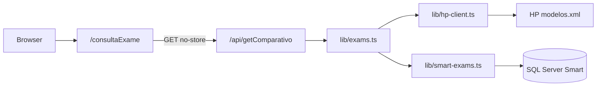

---
tags:
  - projeto
  - xml-reader
  - nextjs
  - integracao
  - hermes-pardini
  - smart
status: ativo
versao: 0.2.0
ultima-revisao: 2026-09-15
projeto: xml-reader
repositorio: C:/Estudos/xml-reader
documentacao-repo: DOCUMENTATION.md
---

# xml-reader (Xml Reader)

Web app interna em **português (`pt-BR`)** para **comparar códigos de formato de exames** entre o XML publicado pelo **Hermes Pardini (HP)** e o cadastro no **SQL Server (Smart)**. A UI lista **somente exames com divergência** de formato (inclui formato Smart nulo).

## Links rápidos

| Nota | Conteúdo |
| --- | --- |
| [[xml-reader - Documentação técnica]] | Referência completa (stack, pastas, APIs, SQL, env, Docker, segurança) |
| [[xml-reader - Fluxo de negócio]] | Pipeline de dados, cruzamento Smart × HP, regra de divergência |
| [[xml-reader - Setup e operação]] | Comandos locais, variáveis de ambiente, Docker, testes |

## Resumo executivo

| Item | Valor |
| --- | --- |
| **Pacote** | `xml-reader` v0.2.0 |
| **Framework** | Next.js 14.1.3 (App Router) |
| **Porta** | 7000 |
| **Auth na UI** | Nenhuma |
| **Deploy** | Docker (`node:22-slim`, `pnpm start`) |
| **Fontes de dados** | HTTPS XML HP + MSSQL Smart |

## Problema de negócio

Divergências entre `ams_hpardini_cod_formato` (Smart) e `CodigoFormato` (XML HP) geram inconsistência operacional na integração de apoio HP. A ferramenta centraliza a detecção dessas divergências.

## Rotas principais

| Rota | Função |
| --- | --- |
| `/` | Home com navegação para o comparador |
| `/consultaExame` | Lista filtrável de divergências (consome `GET /api/getComparativo`) |

## Diagrama (visão geral)

## Manutenção da documentação

- **Obsidian:** estas notas (revisão manual ou via agente).
- **Repositório:** `DOCUMENTATION.md` + `pnpm docs:pdf` → `DOCUMENTATION.pdf`.

Ao alterar comportamento do código, atualizar **ambos** ou manter o Markdown do repo como fonte e regenerar/resumir no Obsidian.
